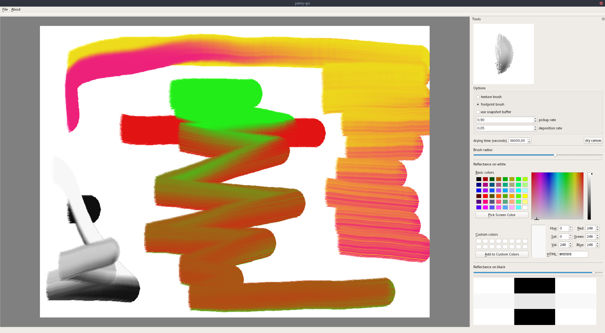
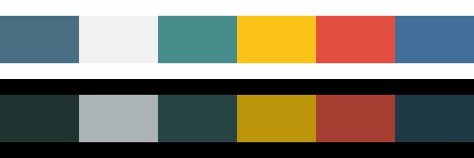

# painty   

Library containing several algorithms for:
- Image processing.
- Non photorealistic rendering: painterly rendering, image abstraction and stylization.
- Paint rendering and realistic mixing.
- Color conversions.
- ... and more to come.

## Paint Renderer

- Implementation of the Kubelka-Munk equations.
- 2d imprint brush (3d on the roadmap).
- 2d texture brush.
- Realistic paint mixing.

### Simple paint program

## Image Stylization and Non Photorealistic Rendering

- Image convolution wrapper for OpenCV.
- Flow fields of images.
- Edge detectors.
- Superpixel segmentation.

### Implementation of the image abstraction filter proposed by Kyprianidis, et al.
| Input image  | Filtered |
| :---:  | :---:  |
|||

## Color Palette Extraction of Images 

Extract color palettes from images based on base pigments. The solver esimates absoprtion and scattering coefficients of each paint as a mixture from the base pigments.

| Primary Magenta | Carmine Red| Cadmium Red Medium| Raw Umber| Cadmium Orange Hue| Cadmium Yellow Hue| Primary Yellow| Leaf Green| Phthalo Green| Cobalt Blue Tone Deep| Ultramarine Blue| Lilac| Lamp Black | Titanium White |
|:-------------:|:-------------:|:-------------:|:-------------:|:-------------:|:-------------:|:-------------:|:-------------:|:-------------:|:-------------:|:-------------:|:-------------:|:-------------:|:-------------:|
| 0      |0      | 0      | 0      | 0     | 0      |0    | 0.0947 | 0.262 | 0.0903 | 0.215  | 0      |0.337  | 0        |
| 0      |0      | 0      | 0      | 0     | 0      |0    | 0      | 0     | 0      | 0      | 0.019  |0      | 0.981    |
| 0      |0      | 0      | 0      | 0     | 0.00757|0    | 0.192  | 0.59  | 0.139  | 0.0424 | 0      |0      | 0.0292   |
| 0      |0      | 0.0854 | 0      | 0.171 | 0.0692 |0.674| 0      | 0     | 0      | 0      | 0      |0      | 0        |
| 0.146  |0.211  | 0.437  | 0      | 0.206 | 0      |0    | 0      | 0     | 0      | 0      | 0      |0      | 0        |
| 0      |0      | 0      | 0.0063 | 0     | 0      |0    | 0.0369 | 0.212 | 0.216  | 0.259  | 0.0625 |0.206  | 0        |

[more details](apps/palette_extraction/README.md)

## References

Implementation based on the following papers:

- Bill Baxter, Vincent Scheib, Ming C. Lin, and Dinesh Manocha. 2001. **DAB: interactive haptic painting with 3D virtual brushes**. In Proceedings of the 28th annual conference on Computer graphics and interactive techniques (SIGGRAPH ’01). Association for Computing Machinery, New York, NY, USA, 461–468. DOI:https://doi.org/10.1145/383259.383313
- Nelson Chu, William Baxter, Li-Yi Wei, and Naga Govindaraju. 2010. **Detail-preserving paint modeling for 3D brushes.** In Proceedings of the 8th International Symposium on Non-Photorealistic Animation and Rendering (NPAR ’10). Association for Computing Machinery, New York, NY, USA, 27–34. DOI:https://doi.org/10.1145/1809939.1809943
- Lindemeier, T., Gülzow, J. M., and Deussen, O. **Painterly rendering using limited paint color palettes.** InVision, Modeling & Visualization(2018), F. Beck, C. Dachsbacher, andF. Sadlo, Eds., The Eurographics Association.
- Lindemeier,  T.,  Metzner,  J.,  Pollak,  L.,  and  Deussen,  O. **Hardware-based non-photorealistic rendering using a painting robot.** Computer Graphics Forum 34, 2 (2015),311–323
- Lindemeier, T., Spicker, M., and Deussen, O. **Artistic composition for painterly rendering.** InVision, Modeling & Visualization(2016),  M.  Hullin,  M.  Stamminger,  andT. Weinkauf, Eds., The Eurographics Association
- Kyprianidis, J. E., and Kang, H. **Image and video abstraction by coherence-enhancing filtering.** Computer Graphics Forum 30, 2 (Apr. 2011), 593–602
