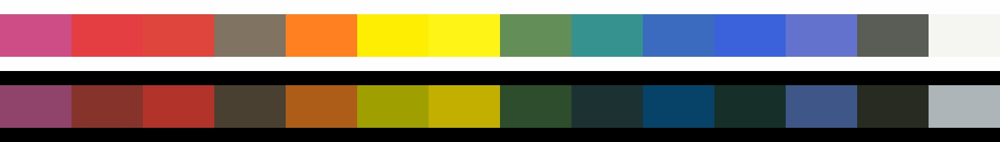
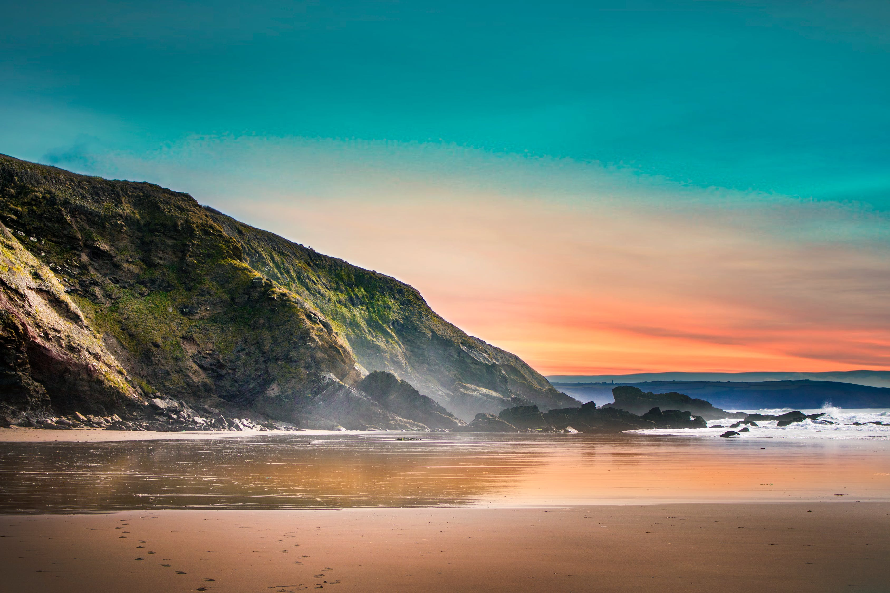

# Digital Palette Mixer

Mix paint palettes for images from base pigments using the Kubelka-Munk equations. Based on the paper of Lindemeier et al. [1].


## Example

This is a collection of base pigments whose absorption and scattering coefficients I've measured in my article [1]:

* Primary Magenta
* Carmine Red
* Cadmium Red Medium
* Raw Umber
* Cadmium Orange Hue
* Cadmium Yellow Hue
* Primary Yellow
* Leaf Green
* Phthalo Green
* Cobalt Blue Tone Deep
* Ultramarine Blue
* Lilac
* Lamp Black
* Titanium White




**Figure 1:** This is a visualization of the pigments and their resulting reflectance on black and white background.


### Create a palette from an input picture and mixing them from base pigments
Command to extract a pallete of size 6 from a input image:
```shell
 ./palette_extraction -b ../palettes/BasePigments/AcrylicsBasePigments.json -i ../doc/palette_extraction/pexels-photo-977737.jpeg -n 6 -o ../doc/palette_extraction/pexels-photo-977737-extractedPalette.json
```



**Figure 2:** The input image [2] we will extract a palette from using the pigments from Figure 1 .


**Figure 3:** The extracted palette rendered on black and white background.


These are the weights computed with the PaintMixer solver:

| Primary Magenta | Carmine Red| Cadmium Red Medium| Raw Umber| Cadmium Orange Hue| Cadmium Yellow Hue| Primary Yellow| Leaf Green| Phthalo Green| Cobalt Blue Tone Deep| Ultramarine Blue| Lilac| Lamp Black | Titanium White |
|:-------------:|:-------------:|:-------------:|:-------------:|:-------------:|:-------------:|:-------------:|:-------------:|:-------------:|:-------------:|:-------------:|:-------------:|:-------------:|:-------------:|
| 0      |0      | 0      | 0      | 0     | 0      |0    | 0.0947 | 0.262 | 0.0903 | 0.215  | 0      |0.337  | 0        |
| 0      |0      | 0      | 0      | 0     | 0      |0    | 0      | 0     | 0      | 0      | 0.019  |0      | 0.981    |
| 0      |0      | 0      | 0      | 0     | 0.00757|0    | 0.192  | 0.59  | 0.139  | 0.0424 | 0      |0      | 0.0292   |
| 0      |0      | 0.0854 | 0      | 0.171 | 0.0692 |0.674| 0      | 0     | 0      | 0      | 0      |0      | 0        |
| 0.146  |0.211  | 0.437  | 0      | 0.206 | 0      |0    | 0      | 0     | 0      | 0      | 0      |0      | 0        |
| 0      |0      | 0      | 0.0063 | 0     | 0      |0    | 0.0369 | 0.212 | 0.216  | 0.259  | 0.0625 |0.206  | 0        |

**Table 1:** These are the weights for mixing the paints as shown in Figure 3 from the base pigments shown in Figure 1.


These are the absorption and scattering coefficients of the extracted palette computed using the mixing solver and output as json:
```json
    [
      {
        "K": [
          1.4671067147397455,
          0.9698479705161202,
          0.7784896610234372
        ],
        "S": [
          0.043076041668283649,
          0.08198151765139729,
          0.06474356110909095
        ]
      },
      {
        "K": [
          0.06539400295725369,
          0.06421413897814343,
          0.06737760085328282
        ],
        "S": [
          0.7612055495574275,
          0.9165666516471837,
          1.0169171824109196
        ]
      },
      {
        "K": [
          1.558403138979944,
          0.706115436691196,
          0.7202637267172865
        ],
        "S": [
          0.06732445406550918,
          0.11887217439153461,
          0.11310752780489106
        ]
      },
      {
        "K": [
          0.013819327449075598,
          0.3409922592740801,
          2.53557022496248
        ],
        "S": [
          1.0679933129986213,
          0.6562281343632745,
          0.01595292961985854
        ]
      },
      {
        "K": [
          0.13424884989254433,
          1.6172395172573063,
          1.8094305792798447
        ],
        "S": [
          0.7523791290476137,
          0.1791898328836181,
          0.1282115084482811
        ]
      },
      {
        "K": [
          1.5054829224326548,
          0.9997198355146348,
          0.584845819500503
        ],
        "S": [
          0.041619867600404109,
          0.10086032379657013,
          0.11154146006304615
        ]
      }
    ]
```

## References

[1]: T. Lindemeier, J. M. Gülzow, and O. Deussen. 2018. Painterly rendering using limited paint color palettes. In Proceedings of the Conference on Vision, Modeling, and Visualization (EG VMV '18). Eurographics Association, Goslar Germany, Germany, 135-145. DOI: https://doi.org/10.2312/vmv.20181263

[2]: Image from (https://www.pexels.com/photo/scenic-view-of-beach-during-dawn-977737/), accessed May 22, 2019.
